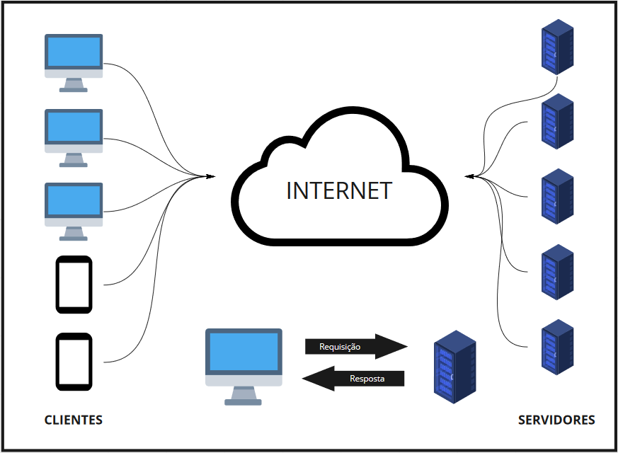

# Arquitetura WEB e REST API`s

---
### Desktop vs Web

- Desktop: são programas/aplicações acessados diretamente no computador do usuário, através do seu sistema operacional. Ex: Word, Photoshop, Paint, Editor de vídeo, IntelliJ
- Web: são aplicações ou sites que acessamos pelo navegador da web,como o Google Chrome, Mozilla Firefox ou Internet Explorer.

### Cliente e Servidor

**Cliente**: Solicita um determinado serviço, através do envio de uma mensagem ao servidor.

**Servidor**: Disponibiliza serviços aos usuários, ou seja, ele recebe uma requisição do usuário, executa a tarefa e envia uma resposta ao cliente.

---

## Protocolo HTTP (Hypertext Transfer Protocol)

Para que exista uma comunicação entre cliente e servidor, precisamos definir uma linguagem comum e para isso utilizamos o protocolo HTTP. 
O protocolo HTTP se divide em 4 partes, cada divisão é responsável por uma parte da mensagem que vai ser enviado do cliente ao servidor e vice-versa.

Abaixo temos as 4 partes que compõem uma mensagem HTTP.

- URI (Uniform Resource Identifier)
- Method
- Header
- Body

## URI (Uniform Resource Identifier)

Exemplos de URI’s:

- `http://minha-aplicacao.com.br/produtos`
- `http://www.google.com.br`
- `http://201.20.10.145/produtos`

## Method / Verbos

Vamos considerar que a URI da nossa aplicação é está: `http://meu-app.com/produtos`, podemos dizer que o nosso recurso é `/produtos`, quer dizer que queremos manipular produtos, eu posso querer listar produtos, cadastrar, alterar e/ou deletar produtos.
Se o endereço é o mesmo, como podemos dizer que tipo de operação estamos querendo fazer?! é para isso que servem os methods ou verbos como também são chamados

| Método   | Ação                                                                                             |
|----------|--------------------------------------------------------------------------------------------------|
| `GET`    | Realiza a pesquisa de um ou mais dados de um determinado recurso                                 | 
| `POST`   | Realiza o envio de dados para persistência de um recurso                                         |
| `PUT`    | Realiza a modificação de todas as atuais informações do recurso enviado no payload da requisição |
| `PATCH`  | Realiza modificações parciais em um recurso enviado no payload da requisição                     |
| `DELETE` | Realiza a remoção de um recurso específico                                                       |

[HTTP Methods](https://developer.mozilla.org/pt-BR/docs/Web/HTTP/Methods).

## Header

São dados adicionais enviados pelo agente para dar contexto a transação que está ocorrendo entre o cliente e o servidor.
Exemplos de agente: browser, postman, uma aplicação, etc.

## Request Payload

No caso do method `GET` não sde deve enviar um payload.
Mas para os demais caso o payload é o corpo da requisição é de fato o conteudo que queremos que chegue até o servidor ou até o cliente.
No caso do recurso de `produtos` o payload seria os dados de um produto que queremos persistir na aplicação, ou que queremos alterar.

## Códigos HTTP

| Categoria | Descrição                                                                                                    |
|-----------|--------------------------------------------------------------------------------------------------------------|
| `1xx`     | Informativo – a solicitação foi aceita ou o processo continua em andamento                                   |
| `2xx`     | Confirmação – a ação foi concluída ou entendida                                                              |
| `3xx`     | Redirecionamento – indica que algo mais precisa ser feito ou precisou ser feito para completar a solicitação |
| `4xx`     | Erro do cliente- indica que a solicitação não pode ser concluída ou contém a sintaxe incorreta               |
| `5xx`     | Erro no servidor – o servidor falhou ao concluir a solicitação                                               |

Categorias mais utilizadas:
- `200 OK`
- `201 CREATED`
- `204 NO CONTENT`
- `400 BAD REQUEST`
- `401 UNAUTHORIZED`
- `403 FORBIDDEN`
- `404 NOT FOUND`
- `500 INTERNAL SERVER ERROR`

[HTTP Status Codes](https://restfulapi.net/http-status-codes/)

## Endpoint

Chamamos de **Endpoint** um recurso completo que tenha a sua URI, Method, Header, Body e Response Status;

### O que é REST (Representational State Transfer)
- Trata-se de um conjunto de principios e definições necessários para a criação de um projeto com interfaces bem definidas.

### O que é API (Application Programming Interface)
- API é um conjunto de normas que possibilita a comunicação entre plataformas através de uma série de padrões e protocolos.

### O que é JSON (JavaScript Object Notation)
- Ele é basicamente um formato leve para troca de informações/dados entre aplicações.

Nos tópicos acima falamos sobre `Request Payload`, quando chamamos o recurso `/produtos` para salvar um determinado produto, devemos enviar as informações deste produto para a persistência no formato JSON.
Exemplo do objeto `Produto` em Java.
~~~java
public class Produto {
    String sku;
    String nome;
    String descricao;
    Double valor;
    Integer quantidade;
}
~~~

Sabendo que nosso objeto `Produto` tem os atributos acima e precisamos realizar o cadastro de um novo produto, representaremos abaixo em `JSON` os dados de um novo produto.

~~~json
{
  "sku": "RS123",
  "nome": "Teclado Mecanico",
  "descricao": "Teclado Mecanico com iluminação RGB",
  "valor": 99.9,
  "quantidade": 999
}
~~~

## [Spring](https://spring.io)

- Framework
- Código aberto
- Criado em 2002
- Possui diversos módulos que se acoplam ao framework principal
  - Aplicação Web (JSP / JSF)
  - Integração com bancos de dados relacionais e não relacionais
  - Integração com sistemas de Cache
  - Serviços de Mensageria
  - Logging

## [Spring Boot](https://spring.io/projects/spring-boot)

- Projetado para ter uma aplicação em execução o mais rápido possível
- Não exige grandes configurações
- Possui vários módulos que fazem a configuração automatica para que a aplicação tenha diversas funcionalidades
  - Servidor Web
  - Agendamentos de tarefas (Jobs)
  - Conexão com bancos de dados relacionais e não relacionais
  - Segurança (Autenticação e Autorização)

[Mais sobre Spring Framework](https://blog.geekhunter.com.br/spring-framework/)

### [Spring Initializr](https://start.spring.io/) para geração rápida de um projeto.